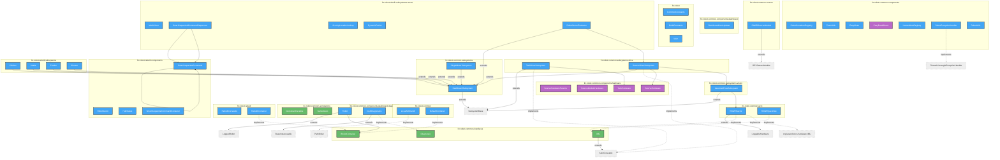

# Code Structure Flowchart

```mermaid
flowchart TD
    subgraph frc_robot_common[frc.robot.common]
        LocalADStarAK[LocalADStarAK]
        DefaultContainer[DefaultContainer]
    end
    subgraph frc_robot_common_gyro[frc.robot.common.gyro]
        RAWRNavX2[RAWRNavX2]
        RAWRQuestNav[RAWRQuestNav]
    end
    subgraph frc_robot_common_components[frc.robot.common.components]
        RobotContainerRegistry[RobotContainerRegistry]
        TeamUtils[TeamUtils]
        EasyMotor[EasyMotor]
        EasyBreakBeam[EasyBreakBeam]
        NamedAutoRegistry[NamedAutoRegistry]
        RobotExceptionHandler[RobotExceptionHandler]
        RobotUtils[RobotUtils]
    end
    subgraph frc_robot_common_components_hardware[frc.robot.common.components.hardware]
        SwerveHardwareParams[SwerveHardwareParams]
        SwerveModuleHardware[SwerveModuleHardware]
        SwerveHardware[SwerveHardware]
        TankHardware[TankHardware]
    end
    subgraph frc_robot_common_components_dashboard_diagnostics[frc.robot.common.components.dashboard.diagnostics]
        CANDiagnostics[CANDiagnostics]
    end
    subgraph frc_robot_common_components_dashboard[frc.robot.common.components.dashboard]
        DashboardAutoUpdater[DashboardAutoUpdater]
    end
    subgraph frc_robot_common_swerve[frc.robot.common.swerve]
        RAWRSwerveModule[RAWRSwerveModule]
    end
    subgraph frc_robot_common_interfaces[frc.robot.common.interfaces]
        IRobotContainer[IRobotContainer]
        IDiagnostic[IDiagnostic]
        IMU[IMU]
    end
    subgraph frc_robot_common_annotations[frc.robot.common.annotations]
        DashboardVariable[DashboardVariable]
        NamedAuto[NamedAuto]
        Robot[Robot]
    end
    subgraph frc_robot_common_subsystems[frc.robot.common.subsystems]
        DashboardSubsystem[DashboardSubsystem]
        SingleMotorSubsystem[SingleMotorSubsystem]
    end
    subgraph frc_robot_common_subsystems_vision[frc.robot.common.subsystems.vision]
        AssumedPoseSubsystem[AssumedPoseSubsystem]
    end
    subgraph frc_robot_common_subsystems_drive[frc.robot.common.subsystems.drive]
        TankDriveSubsystem[TankDriveSubsystem]
        SwerveDriveSubsystem[SwerveDriveSubsystem]
    end
    subgraph frc_robot[frc.robot]
        CommonConstants[CommonConstants]
        BuildConstants[BuildConstants]
        Main[Main]
        Robot[Robot]
    end
    subgraph frc_robot_rebuilt[frc.robot.rebuilt]
        RebuiltConstants[RebuiltConstants]
        RebuiltContainer[RebuiltContainer]
    end
    subgraph frc_robot_rebuilt_components[frc.robot.rebuilt.components]
        RobotSector[RobotSector]
        HubStatus[HubStatus]
        SmartSequentialCommand[SmartSequentialCommand]
        SmartSequentialCommandContainer[SmartSequentialCommandContainer]
    end
    subgraph frc_robot_rebuilt_subsystems[frc.robot.rebuilt.subsystems]
        Climber[Climber]
        Intake[Intake]
        Feeder[Feeder]
        Shooter[Shooter]
    end
    subgraph frc_robot_rebuilt_subsystems_smart[frc.robot.rebuilt.subsystems.smart]
        MathShoot[MathShoot]
        SmartSequentialCommandSequencer[SmartSequentialCommandSequencer]
        ScoringLocationLookup[ScoringLocationLookup]
        DynamicPather[DynamicPather]
        RobotSectorEvaluator[RobotSectorEvaluator]
    end
    LoggableHardware[LoggableHardware]
    RAWRNavX2 -->|extends| LoggableHardware
    BaseInstanceable_CANDiagnostics[BaseInstanceable<CANDiagnostics]
    CANDiagnostics -->|extends| BaseInstanceable_CANDiagnostics
    REVSwerveModule[REVSwerveModule]
    RAWRSwerveModule -->|extends| REVSwerveModule
    AutoCloseable[AutoCloseable]
    IMU -->|extends| AutoCloseable
    SubsystemBase[SubsystemBase]
    DashboardSubsystem -->|extends| SubsystemBase
    SingleMotorSubsystem -->|extends| DashboardSubsystem
    AssumedPoseSubsystem -->|extends| SubsystemBase
    TankDriveSubsystem -->|extends| SubsystemBase
    SwerveDriveSubsystem -->|extends| DashboardSubsystem
    Climber -->|extends| DashboardSubsystem
    Intake -->|extends| DashboardSubsystem
    Feeder -->|extends| DashboardSubsystem
    Shooter -->|extends| DashboardSubsystem
    RobotSectorEvaluator -->|extends| DashboardSubsystem
    LoggedRobot[LoggedRobot]
    Robot -->|extends| LoggedRobot
    Pathfinder[Pathfinder]
    LocalADStarAK -.implements.-> Pathfinder
    RAWRNavX2 -.implements.-> IMU
    org_lasarobotics_hardware_IMU[org.lasarobotics.hardware.IMU]
    RAWRNavX2 -.implements.-> org_lasarobotics_hardware_IMU
    RAWRQuestNav -.implements.-> IMU
    Thread_UncaughtExceptionHandler[Thread.UncaughtExceptionHandler]
    RobotExceptionHandler -.implements.-> Thread_UncaughtExceptionHandler
    CANDiagnostics -.implements.-> IDiagnostic
    DefaultContainer -.implements.-> IRobotContainer
    TankDriveSubsystem -.implements.-> AutoCloseable
    SwerveDriveSubsystem -.implements.-> AutoCloseable
    RebuiltContainer -.implements.-> IRobotContainer
    AssumedPoseSubsystem --> RAWRNavX2
    TankDriveSubsystem --> TankHardware
    SwerveDriveSubsystem --> SwerveHardware
    SwerveDriveSubsystem --> AssumedPoseSubsystem
    SmartSequentialCommand --> SmartSequentialCommand
    SmartSequentialCommandSequencer --> SmartSequentialCommand
    SmartSequentialCommandSequencer --> SmartSequentialCommand
    RobotSectorEvaluator --> SwerveDriveSubsystem
    Robot --> IRobotContainer
    style LocalADStarAK fill:#42a5f5,stroke:#333,stroke-width:2px,color:#fff
    style RAWRNavX2 fill:#42a5f5,stroke:#333,stroke-width:2px,color:#fff
    style RAWRQuestNav fill:#42a5f5,stroke:#333,stroke-width:2px,color:#fff
    style RobotContainerRegistry fill:#42a5f5,stroke:#333,stroke-width:2px,color:#fff
    style TeamUtils fill:#42a5f5,stroke:#333,stroke-width:2px,color:#fff
    style SwerveHardwareParams fill:#ba68c8,stroke:#333,stroke-width:2px,color:#fff
    style SwerveModuleHardware fill:#ba68c8,stroke:#333,stroke-width:2px,color:#fff
    style SwerveHardware fill:#ba68c8,stroke:#333,stroke-width:2px,color:#fff
    style TankHardware fill:#ba68c8,stroke:#333,stroke-width:2px,color:#fff
    style EasyMotor fill:#42a5f5,stroke:#333,stroke-width:2px,color:#fff
    style EasyBreakBeam fill:#ba68c8,stroke:#333,stroke-width:2px,color:#fff
    style NamedAutoRegistry fill:#42a5f5,stroke:#333,stroke-width:2px,color:#fff
    style RobotExceptionHandler fill:#42a5f5,stroke:#333,stroke-width:2px,color:#fff
    style CANDiagnostics fill:#42a5f5,stroke:#333,stroke-width:2px,color:#fff
    style DashboardAutoUpdater fill:#42a5f5,stroke:#333,stroke-width:2px,color:#fff
    style RobotUtils fill:#42a5f5,stroke:#333,stroke-width:2px,color:#fff
    style DefaultContainer fill:#42a5f5,stroke:#333,stroke-width:2px,color:#fff
    style RAWRSwerveModule fill:#42a5f5,stroke:#333,stroke-width:2px,color:#fff
    style IRobotContainer fill:#66bb6a,stroke:#333,stroke-width:2px,color:#fff
    style IDiagnostic fill:#66bb6a,stroke:#333,stroke-width:2px,color:#fff
    style IMU fill:#66bb6a,stroke:#333,stroke-width:2px,color:#fff
    style DashboardVariable fill:#66bb6a,stroke:#333,stroke-width:2px,color:#fff
    style NamedAuto fill:#66bb6a,stroke:#333,stroke-width:2px,color:#fff
    style Robot fill:#66bb6a,stroke:#333,stroke-width:2px,color:#fff
    style DashboardSubsystem fill:#42a5f5,stroke:#333,stroke-width:2px,color:#fff
    style SingleMotorSubsystem fill:#42a5f5,stroke:#333,stroke-width:2px,color:#fff
    style AssumedPoseSubsystem fill:#42a5f5,stroke:#333,stroke-width:2px,color:#fff
    style TankDriveSubsystem fill:#42a5f5,stroke:#333,stroke-width:2px,color:#fff
    style SwerveDriveSubsystem fill:#42a5f5,stroke:#333,stroke-width:2px,color:#fff
    style CommonConstants fill:#42a5f5,stroke:#333,stroke-width:2px,color:#fff
    style RebuiltConstants fill:#42a5f5,stroke:#333,stroke-width:2px,color:#fff
    style RobotSector fill:#42a5f5,stroke:#333,stroke-width:2px,color:#fff
    style HubStatus fill:#42a5f5,stroke:#333,stroke-width:2px,color:#fff
    style SmartSequentialCommand fill:#42a5f5,stroke:#333,stroke-width:2px,color:#fff
    style SmartSequentialCommandContainer fill:#42a5f5,stroke:#333,stroke-width:2px,color:#fff
    style RebuiltContainer fill:#42a5f5,stroke:#333,stroke-width:2px,color:#fff
    style Climber fill:#42a5f5,stroke:#333,stroke-width:2px,color:#fff
    style Intake fill:#42a5f5,stroke:#333,stroke-width:2px,color:#fff
    style Feeder fill:#42a5f5,stroke:#333,stroke-width:2px,color:#fff
    style Shooter fill:#42a5f5,stroke:#333,stroke-width:2px,color:#fff
    style MathShoot fill:#42a5f5,stroke:#333,stroke-width:2px,color:#fff
    style SmartSequentialCommandSequencer fill:#42a5f5,stroke:#333,stroke-width:2px,color:#fff
    style ScoringLocationLookup fill:#42a5f5,stroke:#333,stroke-width:2px,color:#fff
    style DynamicPather fill:#42a5f5,stroke:#333,stroke-width:2px,color:#fff
    style RobotSectorEvaluator fill:#42a5f5,stroke:#333,stroke-width:2px,color:#fff
    style BuildConstants fill:#42a5f5,stroke:#333,stroke-width:2px,color:#fff
    style Main fill:#42a5f5,stroke:#333,stroke-width:2px,color:#fff
    style Robot fill:#42a5f5,stroke:#333,stroke-width:2px,color:#fff
    style LoggableHardware fill:#eeeeee,stroke:#999,color:#333,stroke-dasharray: 5 5
    style BaseInstanceable_CANDiagnostics fill:#eeeeee,stroke:#999,color:#333,stroke-dasharray: 5 5
    style REVSwerveModule fill:#eeeeee,stroke:#999,color:#333,stroke-dasharray: 5 5
    style AutoCloseable fill:#eeeeee,stroke:#999,color:#333,stroke-dasharray: 5 5
    style SubsystemBase fill:#eeeeee,stroke:#999,color:#333,stroke-dasharray: 5 5
    style LoggedRobot fill:#eeeeee,stroke:#999,color:#333,stroke-dasharray: 5 5
    style Pathfinder fill:#eeeeee,stroke:#999,color:#333,stroke-dasharray: 5 5
    style org_lasarobotics_hardware_IMU fill:#eeeeee,stroke:#999,color:#333,stroke-dasharray: 5 5
    style Thread_UncaughtExceptionHandler fill:#eeeeee,stroke:#999,color:#333,stroke-dasharray: 5 5
```
